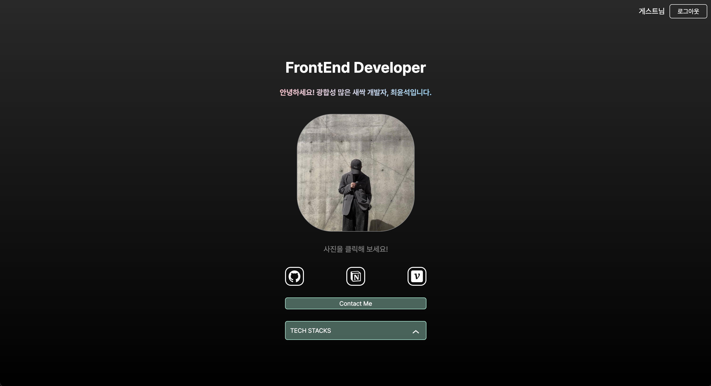

# My Portfolio

나를 소개하는 포트폴리오 사이트

## 🙇 프로젝트 소개

저의 기술스택과 여태까지 진행한 프로젝트를 소개하는 포트폴리오 사이트입니다.

## ⏱️ 개발 기간

- 2024.05.02 ~ 2024.05.14+ (13+일)

## 👨 구성 인원

- 개인 프로젝트

## ⚙️ 기술 스택

- Next.js
- TypeScript
- Emotion
- Zustand

## 📍 주요 기능

#### 1️⃣ 입장 시 이름 입력이 필요하며 입력 후 애니메이션 동작 후 메인페이지를 볼 수 있습니다.

#### 2️⃣ 메인 페이지에서 저의 깃헙, 노션, 벨로그 주소로 링크이동할 수 있고, 이메일(Contact Me) 주소 및 기술 스택을 볼 수 있게 구현하였습니다. 사진 클릭 시 프로젝트 기록들이 있는 주소로 이동됩니다.

#### 3️⃣ 메인 페이지에서 사진 클릭 시 프로젝트 타임라인 페이지로 라우팅되며 여기서 타임라인 버튼들을 눌러 제가 만든 프로젝트들의 설명을 볼 수 있게 구현하였습니다.

